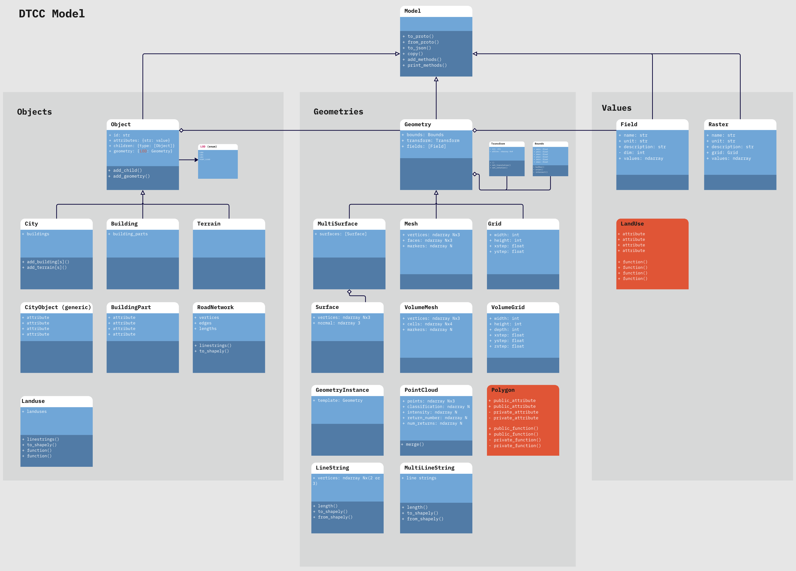

Data Model
==========

Overview
--------

The DTCC Data Model is designed to represent city-scale objects, their geometries,
and associated data values in a consistent and extensible manner. It enables the
modeling of physical and virtual city elements—ranging from entire cities and buildings
to finer components such as park benches or road networks—while supporting robust
spatial analysis and I/O operations.

High-Level Design
-----------------

The DTCC Data Model is organized into three core categories:

- **Objects:**  
  These represent the physical or virtual entities within a city (e.g., buildings,
  terrains, road networks). Every object inherits from the common base class
  ``Object``, which in turn derives from a broader ``Model``. All objects have a unique
  identifier and support hierarchical (parent-children) relationships. Importantly, each
  object may possess multiple geometrical representations (e.g., different levels of
  detail).

- **Geometries:**  
  Geometries define the spatial representation of objects. Every geometry derives from
  a common base class ``Geometry`` and comes in various types—ranging from 2D primitives
  (polygons, linestrings) to 3D representations (meshes, point clouds). Each geometry
  includes attributes such as bounds, coordinate systems, and affine transforms, enabling
  robust spatial computations and transformations.

- **Values:**  
  Value classes are used to associate data with the geometry of an object. Examples
  include the ``Field`` class for scalar or vector data and the ``Raster`` class for
  grid-based imagery. This separation of spatial representation from descriptive or
  simulation data ensures that the model remains flexible and maintainable.

Key Features
------------

- **Unique Identifiers & Hierarchical Structure:** Every object includes an ``id`` 
  and supports parent-child relationships to naturally represent complex structures
  (e.g., a city containing buildings, which in turn consist of building parts).  
- **Standardized Spatial Handling:** Geometries calculate bounds automatically and
  maintain coordinate system and transformation details, ensuring that local
  representations can be converted to global coordinates.  
- **Robust Serialization:** All core classes implement ``to_proto()`` and
  ``from_proto()`` methods, enabling efficient, standardized serialization via
  Protobuf.
- **Extensibility and Modularity:**  
  The use of base classes (``Model``, ``Object``, ``Geometry``) ensures that common
  functionality is inherited by specialized classes, reducing duplication and
  facilitating consistent behavior across the system.

Examples in the Model
---------------------

- **Buildings and Building Parts:**  
  A ``Building`` object (inheriting from ``Object``) can include multiple
  ``BuildingPart`` objects. Each building or part can have multiple geometries representing
  various levels of detail, such as a simple footprint (LOD0) or a detailed 3D mesh.

- **City as a Container:**  
  The ``City`` class aggregates various objects—buildings, terrain, road networks—
  managing their spatial relationships and providing helper methods to manipulate or
  query these elements.

- **Spatial Data Management:**  
  The base class ``Geometry`` and its derivatives (e.g., ``Mesh``, ``Grid``, ``Surface``)
  automatically calculate bounds, support merging operations, and handle coordinate
  transformations, which are essential for integrating with external GIS systems.

UML Diagram
-----------

Below is an overview of the data model illustrated as a UML diagram. This diagram shows
the high-level organization into Objects, Geometries, and Values, and highlights key
inheritance relationships.

*UML diagram of the DTCC Data Model, illustrating the three core categories
(Objects, Geometries, and Values) and their interrelationships.*

Conclusion
----------

The DTCC Data Model offers a comprehensive and modular framework for city modeling.
Its clear separation into Objects, Geometries, and Values provides flexibility and
scalability. By leveraging Python dataclasses for clarity and Protobuf for robust I/O,
the model supports both detailed local analyses and broad interoperability with
external systems.

For more detailed documentation, please refer to the generated API reference pages.
