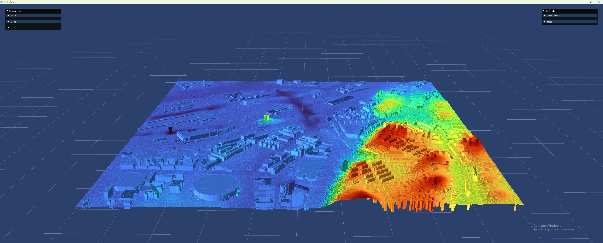

Demo: Build City
================

This demo illustrates how to build a complete city model by combining point
cloud data and building footprints to generate terrain rasters, meshes, and LOD1
buildings.

To run the demo, type::

    $ python build_city.py

Purpose
-------
This demo demonstrates the end-to-end workflow of downloading data, processing it,
and constructing a city model. Specifically, it covers:
- Downloading point cloud data and building footprints.
- Removing outliers from the point cloud.
- Building a terrain raster and mesh from the processed data.
- Extracting roof points and computing building heights.
- Generating LOD1 (Level of Detail 1) buildings.
- Creating a city model by assembling the buildings and terrain geometries.
- Visualizing the final city model using the 3D viewer.

Expected Output
----------------

Step-by-step
------------

1. **Define Bounds:**
   Specify the spatial bounds for a residential area in Helsingborg by setting a
   height/width value (here, 2000.0 units).

   .. code:: python

       h = 2000.0
       bounds = dtcc.Bounds(319891, 6399790, 319891 + h, 6399790 + h)

2. **Download Data:**
   Retrieve the point cloud and building footprints within the defined bounds.

   .. code:: python

       pointcloud = dtcc.download_pointcloud(bounds=bounds)
       buildings = dtcc.download_footprints(bounds=bounds)

3. **Process the Point Cloud:**
   Remove global outliers from the point cloud to improve data quality.

   .. code:: python

       pointcloud = pointcloud.remove_global_outliers(3.0)

4. **Build Terrain Raster and Mesh:**
   Construct a terrain raster and a corresponding mesh from the processed
   point cloud. These represent the underlying terrain of the city model.

   .. code:: python

       raster = dtcc.builder.build_terrain_raster(pointcloud, cell_size=5,
                                                  ground_only=True)
       mesh = dtcc.builder.build_terrain_mesh(raster)

5. **Process Building Footprints:**
   Extract roof points from the building footprints and compute building heights
   using the terrain raster.

   .. code:: python

       buildings = dtcc.extract_roof_points(buildings, pointcloud)
       buildings = dtcc.compute_building_heights(buildings, raster, overwrite=True)

6. **Build LOD1 Buildings:**
   Generate detailed (LOD1) building representations using the computed
   building heights and terrain data.

   .. code:: python

       buildings = dtcc.builder.build_lod1_buildings(
           buildings, default_ground_height=raster.min,
           always_use_default_ground=True
       )

7. **Create City Model:**
   Assemble the city model by creating a city object and adding the processed
   buildings and terrain geometries.

   .. code:: python

       city = dtcc.City()
       city.add_buildings(buildings)
       city.add_terrain(raster)
       city.add_terrain(mesh)

8. **Visualize the City:**
   Display the constructed city model using the 3D viewer.

   .. code:: python

       city.view()

Complete Code
-------------
Below is the complete code for this demo:

.. literalinclude:: ../../demos/build_city.py
   :language: python
   :linenos:
