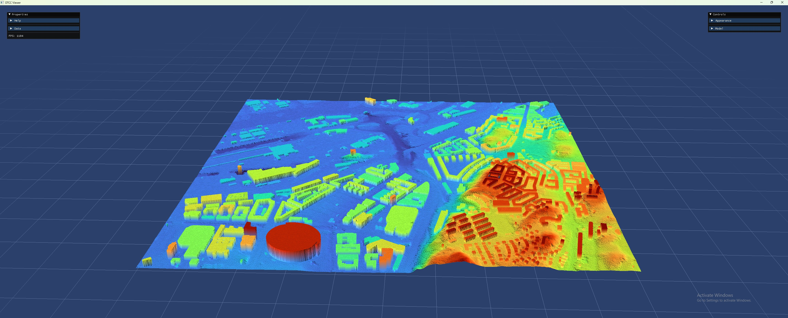

Demo: Build City Mesh
=====================

This demo illustrates how to build a city mesh from a point cloud and building
footprints.

To run the demo, type::

    $ python build_city_mesh.py

Purpose
-------
This demo demonstrates how to download point cloud and building footprint data,
process the data to extract roof points and compute building heights, and create a
city model. From the city model, a city mesh is generated at a specified level of
detail (LOD) and visualized.

Expected Output
----------------

Step-by-step
------------

1. **Define Bounds:**
   Specify the spatial bounds for a residential area in Helsingborg by setting a
   height/width value (here, 2000.0 units).

   .. code:: python

       h = 2000.0
       bounds = dtcc.Bounds(319891, 6399790, 319891 + h, 6399790 + h)

2. **Download Data:**
   Retrieve the point cloud and building footprints for the defined bounds.

   .. code:: python

       pointcloud = dtcc.download_pointcloud(bounds=bounds)
       buildings = dtcc.download_footprints(bounds=bounds)

3. **Process the Point Cloud:**
   Remove global outliers from the point cloud to improve data quality.

   .. code:: python

       pointcloud = pointcloud.remove_global_outliers(3.0)

4. **Build Terrain Raster:**
   Construct a terrain raster from the processed point cloud. Parameters such as
   cell size, radius, and ground filtering are specified.

   .. code:: python

       raster = dtcc.build_terrain_raster(pointcloud, cell_size=2, radius=3,
                                          ground_only=True)

5. **Process Building Footprints:**
   Extract roof points from the building footprints and compute building heights
   using the terrain raster.

   .. code:: python

       buildings = dtcc.extract_roof_points(buildings, pointcloud)
       buildings = dtcc.compute_building_heights(buildings, raster, overwrite=True)

6. **Create City Model:**
   Instantiate a city object and add the processed building and terrain data.
   Buildings outside the terrain are removed.

   .. code:: python

       city = dtcc.City()
       city.add_terrain(raster)
       city.add_buildings(buildings, remove_outside_terrain=True)

7. **Build City Mesh:**
   Generate a city mesh from the city model using a specified level of detail (LOD).

   .. code:: python

       mesh = dtcc.build_city_mesh(city, lod=dtcc.GeometryType.LOD0)

8. **Visualize the Mesh:**
   View the resulting city mesh using the ``view()`` method.

   .. code:: python

       mesh.view()

Complete Code
-------------
Below is the complete code for this demo:

.. literalinclude:: ../../demos/build_city_mesh.py
   :language: python
   :linenos:
