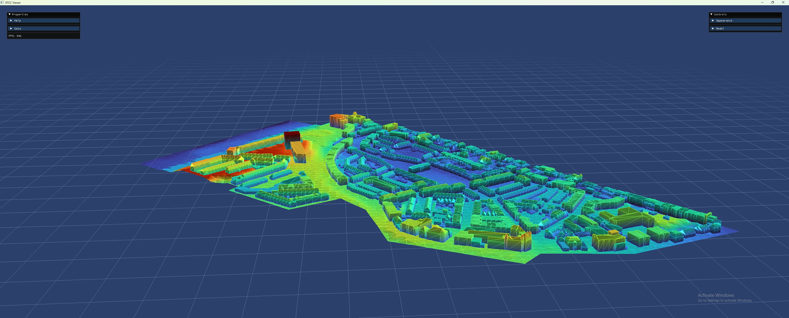

Demo: View CityJSON
===================

This demo illustrates how to load and view a CityJSON city model.

To run the demo, type::

    $ python view_cityjson.py

Purpose
-------

This demo demonstrates how to download a CityJSON file from an external URL,
load the city model from the file, and visualize it using the DTCC platform.

Expected Output
----------------

Step-by-step
------------

1. **Download CityJSON File:**
   Retrieve a CityJSON file from a specified URL. This file contains the city
   model data in the CityJSON format.

   .. code:: python

       from urllib.request import urlretrieve
       url = "https://3d.bk.tudelft.nl/opendata/cityjson/3dcities/v2.0/DenHaag_01.city.json"
       urlretrieve(url=url, filename="city.json")

2. **Load City Model:**
   Use the ``load_city`` function provided by DTCC to load the city model from
   the downloaded CityJSON file.

   .. code:: python

       import dtcc
       city = dtcc.load_city("city.json")

3. **View the City Model:**
   Visualize the loaded city model by invoking its ``view()`` method.

   .. code:: python

       city.view()

Complete Code
-------------
Below is the complete code for this demo:

.. literalinclude:: ../../demos/view_cityjson.py
   :language: python
   :linenos:
