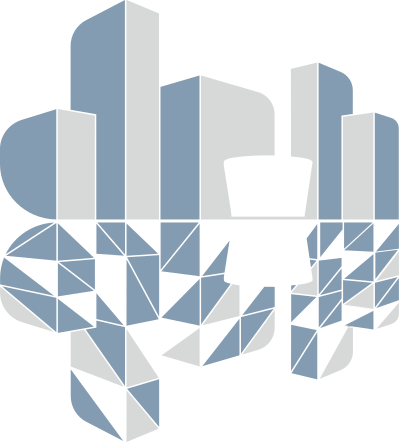

DTCC Platform
=============

Welcome to the documentation pages for `DTCC Platform
<https://github.com/dtcc-platform/>`__, an open-source Python platform for
digital twinning of cities.

The platform is developed and maintained by the `Digital Twin Cities
Centre <https://dtcc.chalmers.se/>`__ (DTCC) hosted by Chalmers University of
Technology.

I have added this on purpose 18 Feb 13.00 CET

Table of contents
-----------------

.. toctree::
   :maxdepth: 3

   installation
   data_model
   data_classes
   data_formats
   usage
   demos
   api
   development
