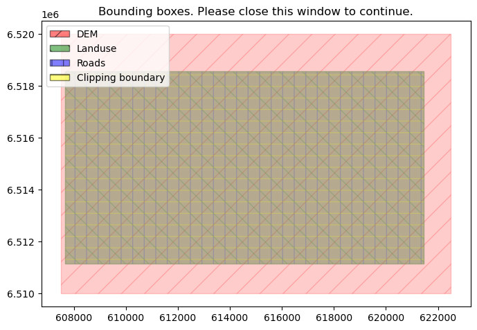
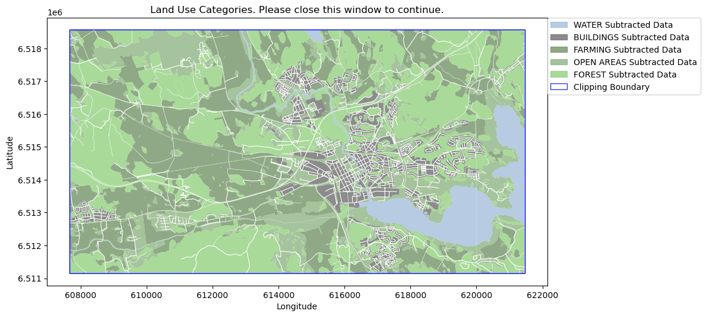

DTCC Workflows
----------------------------

Table of Contents
-----------------

1. [Workflow Generate Unreal Tiles](#Workflow-Generate-Unreal-Tiles)
2. [Workflow geojson to DF](#Workflow-geojson-to-DF)
3. [Workflow dte](#workflow-dte)
4. [Workflow iboflow](#workflow-iboflow)
5. [Workflow sfpg](#workflow-sfpg)
6. [Workflow table](#workflow-table)


# Workflow Generate Unreal Tiles



### 1\. Setting up the virtual environment

- Install python 3.10 from [here](https://www.python.org/downloads/release/python-3100/)  
- Specify installation directory to `C:\Python310`  
- On your terminal cd to the workflows directory using 

`cd <path\to\workflows\directory>`
- On your terminal launch python 310 using

`C:\Python310\python.exe`
- Create the virtual environment using

`C:\Python310\python.exe -m venv workflow_unreal_tiles`
- Activate the venv

`.\workflow_unreal_tiles\Scripts\Activate`
- Update pip

`python -m pip install --upgrade pip setuptools wheel`
- Install libraries from requirements

`pip install -r workflow_unreal_tiles.txt`

- To deactivate

`deactivate`


### 2\. Preparing the Data

-   Obtain the necessary data from Lantmäteriet.
-   Place the data in the following directories within the `workflows` directory:
    -   `data/dem_data` for DEM data (.tif)
    -   `data/landuse_data` for land use data (.shp)
    -   `data/road_data` for road data (.shp)
    -   `data/overlay_data` for road data (.zip) (hardcoded for TV noise data by SWECO) 
    
    Note: Noise data can be found at : `GIS-data Buller\Buller_ljudutbredning\ <select one scenario>`

### 3\. Activating the virtual environment

-   `.\workflow_unreal_tiles\Scripts\Activate`


### 4\. Navigate to the Workflows Directory

-   Change to the `workflows` directory:
    `cd path/to/workflows`

### 5\. Run the Workflow Script

-   Execute the `workflow_unreal_tiles.py` script using:
    `python workflow_unreal_tiles.py --no-plots`

Upon successful execution, this will produce a new folder named `unreal_tiles` within the `workflows` directory.

## Data requirements and config
- Digital Elevation Model (DEM) in geotiff format. This is used for the terrain. Multiple tiles are fine. 
- Specify the cell resolution (meters per pixel) in the `unreal_tiles_config.json`
- Road centerline data as .shp
    - If the road centerline data contains an attribute with different road widths, then include a json on how to do the road width mapping such that we can replace it in `unreal_tiles_config.json`
    ``` JSON
    BUFFER_DICT = {
    "VÄGBN.M": 10,
    "VÄGGG.D": 10,
    "VÄGGG.M": 10,
    "VÄGKV.M": 10,
    "VÄGBNU.M": 10
    }
    ```
- Landuse data as .shp. 
    - Make sure the landuse features include the following along with a mapping of attributes.
    ``` JSON
    LANDUSE_MAPPING = {                         
    "GLACIER": ["ÖPGLAC"],
    "BUILDINGS": ["BEBSLUT", "BEBHÖG", "BEBLÅG", "BEBIND"],
    "FARMING": ["ODLÅKER", "ODLFRUKT"],
    "OPEN AREAS": ["ÖPMARK", "ÖPKFJÄLL", "ÖPTORG"],
    "FOREST": ["SKOGBARR", "SKOGLÖV", "SKOGFBJ"],
    "UNMAPPED": ["MRKO"]                    
    }
    ```
- Overlay data as .shp. 
    - Ensure that there is only one other column in the dataset with values that will map to coloured isolines.
- Finally, ensure that all the data is in the same crs, or else the code will throw an error.

Note: To include buildings in this workflow, please look at the `workflow_unreal_tiles_building.py` script. The script is an addon to this workflow and calls DTCC functions to generate buildings. The resulting 3D mesh is then positioned correctly based on the bounding box of the unreal engine tiles. Additional data to be passed here is a LiDAR point cloud corresponding to the requested area.

# Workflow geojson to DF

### 1\. Install dependencies
`pip install -U dragonfly-core`  
`pip install dragonfly-energy`

Ensure other dependencies for Honeybee-energy are met.   
Honeybee-energy leverages the EnergyPlus simulation engine and the OpenStudio SDK in order to add energy simulation properties and capabilities to honeybee-core.  
You can use the ladybug tools pollination installer to make sure the simulation dependencies are installed.  
[Honebee-energy](https://github.com/ladybug-tools/honeybee-energy#honeybee-energy)

### 2\. Preparing the data
- Ensure that city.geojson exists inside the data folder.
- An optional `clip.geojson` boundary can be provided to set the buildings outside the boundary as `context_shade`

### 3\. Running the script

-   Change to the `workflows` directory:
    `cd path/to/workflows`
### 4\. Run the Workflow Script
-   Execute the `workflow_geojson_to_DF.py` script using:

`python .\workflow_geojson_to_DF.py --directory_path <..\relative\path\to\geojson\directory>`


### Optional Arguments:

1. `--multiplier`: 
    - Use this flag to activate the multiplier feature.
    - Default is `False` (multiplier is off).

2. `--generate_DFenriched_geojson`:
    - Use this flag to generate DF enriched geojson.
    - Default is `False` (enriched geojson generation is off).
    - Use this to get material quantities as geojson.

3. `--filter_height_less_than`: 
    - Filter out buildings with a height less than the specified value.
    - Default is `3` (buildings below 3 meters are filtered out).

4. `--filter_height_greater_than`: 
    - Filter out buildings with a height greater than the specified value.
    - Default is `100` (buildings above 100 meters are filtered out).

5. `--filter_area_less_than`: 
    - Filter out buildings with an area less than the specified value (in square meters).
    - Default is `100` (buildings below 100 square meters are filtered out).

### Example:

To execute the script using the multiplier, generate an enriched geojson, and apply custom filtering:

`python .\workflow_geojson_to_DF.py --directory_path ..\path\to\data --multiplier --generate_DFenriched_geojson --filter_height_less_than 5 --filter_height_greater_than 90 --filter_area_less_than 120`

- This example will turn on the multiplier, generate the enriched geojson, and filter out buildings with a height below 5 meters or above 90 meters and with an area below 120 square meters.

## What does the script do

The script, `workflow_geojson_to_DF.py`, primarily serves the purpose of processing a city's building information stored in a GeoJSON file to generate EnergyPlus (IDF) and gbXML models. It can also produce enriched Dragonfly models, and optional filters can be applied to buildings based on their height or area.

Here's a summarized breakdown of its core functionalities:

1.  Preparing the GeoJSON Data:

    -   The script begins by copying the source GeoJSON file and creating an enriched version of it.
    -   Buildings that do not meet specified height or area criteria are filtered out. This ensures that only relevant buildings are considered for subsequent operations.
2.  Enriching the GeoJSON Data:

    -   The city's bounding box is determined and associated with the GeoJSON.
    -   Building properties such as ID, name, status, and type are added or updated. The city's project-related data is also embedded within the GeoJSON.
3.  Generating Dragonfly Model:

    -   The enriched GeoJSON file serves as the basis for creating a Dragonfly city model.
    -   Using the Dragonfly model and the information in the GeoJSON, the properties of each building are adjusted, particularly their position above ground and their associated energy properties.
4.  Mapping to Building Programs:

    -   During the adjustment of building properties, a vital mapping process occurs, linking the building types from the GeoJSON to predefined Dragonfly building programs. This is achieved using the `BUILDING_PROGRAM_DICT`.
    -   This dictionary ensures that buildings are not only represented geometrically but also carry meaningful energy-related properties derived from their function or type. For instance, a building labeled as "Hospital" in the GeoJSON might be associated with a detailed energy profile in Dragonfly suitable for a hospital's typical energy use.
5.  Serialization & Conversion:

    -   The Dragonfly model can optionally be serialized to an enriched GeoJSON and a Dragonfly JSON (DFJSON) file.
    -   Using the Dragonfly model, the script generates Honeybee energy models and further serializes them into EnergyPlus (IDF) and gbXML formats, ready for energy simulations.

### Global Constants:

-   Project Name: `City`

-   Building Specifications:

    -   Floor-to-Floor Height: `3 meters`
    -   Window-to-Wall Ratio: `0.1 (or 10%)`
    -   Window Height: `1.6 meters`
    -   Window Sill Height: `0.7 meters`
    -   Window Spacing (Horizontal): `3 meters`
    -   Default Ideal Air: `Enabled`
    -   Default Building Program: `HighriseApartment`

### Building Program Dictionary:

The script uses the `BUILDING_PROGRAM_DICT` to map building types from the GeoJSON to corresponding Dragonfly building programs. This ensures buildings have energy-related properties aligned with their function or type. Here's an extract:

| GeoJSON Building Type | Mapped Dragonfly Program |
| --- | --- |
| Bostad; Småhus friliggande | HighriseApartment |
| Bostad; Flerfamiljshus | HighriseApartment |
| Industri; Kemisk industri | Laboratory |
| Samhällsfunktion; Badhus | Outpatient |
| Samhällsfunktion; Sjukhus | Hospital |
| Samhällsfunktion; Skola | PrimarySchool |
| ... | ... |

*(Note: The table above is a partial representation. The actual dictionary contains many more mappings.)*

### Other Building Types:

The `honeybee_energy.lib` module provides a range of pre-defined building types. These can be accessed and potentially added to the dictionary in future iterations of the script. Some of the available building types are: `SmallDataCenterHighITE`, `QuickServiceRestaurant`, `Outpatient`, `HighriseApartment`, `SmallOffice`, `MediumOffice`, `Warehouse`, `Retail`, and so forth.

## Running using jupyter notebook

```python
# Import workflow
from workflows.workflow_geojson_to_DF import generate_EP_assets

# Set operating directory
import os
os.chdir(<full\path\to\geojson\directory>`)


generate_EP_assets(
    '<your_file.geojson>',
    generate_DFenriched_geojson=True,
    filter_height_less_than = 3,
    filter_height_greater_than = 100,
    filter_area_less_than = 100)
   ```
